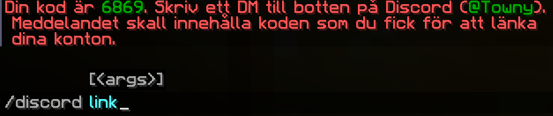
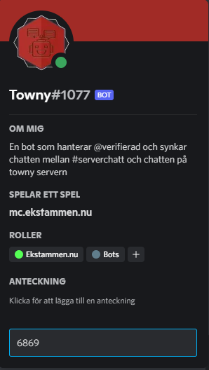

# [Discord](http://discord.ekstammen.nu)
Vår discord är en av grundpelarna och hjärtat i vår community där vi har vi en härlig samling glada och engagerade medlemmar.  

Här hittar du alla våra senaste nyheter, du kan posta förslag tankar och ideer och på så sätt påverka utvecklingen av Ekstammen.  
Om du dessutom är [verifierad](./discord.md#koppla-ihop-dina-konton) så kan du delta i utlottningar och få fler fördelar på discorden.
  
Man kan även skapa egna röstkanaler som man bestämmer över själv så man kan spela ostört med vänner eller låta alla komma in och säga hej.  
Om man vill ha bakgrundsmusik har vi även en bot som löser det
  
Discord är också en suverän plats att få hjälp.  
Antingen frågar man direkt i en passande kanal eller så använder man vår supportbot genom kommandot `/ticket`

# Koppla ihop dina konton
Genom att koppla ihop dina konton så kommer du få samma namn på discord som du har på servern.  
Detta hjälper t.ex. staff när du skapar en ticket.  

Du får också tillgång till våra olika utlottningar som vi har

## Så här gör du
1. Skriv `/discord link` i chatten  

1. Koden du fick (i detta fall `6869`) skickar du i ett <ins>direkt-meddelande</ins> till botten **@Towny** på discord  

1. Om du skrev rätt kod är dina konton kopplade.  
